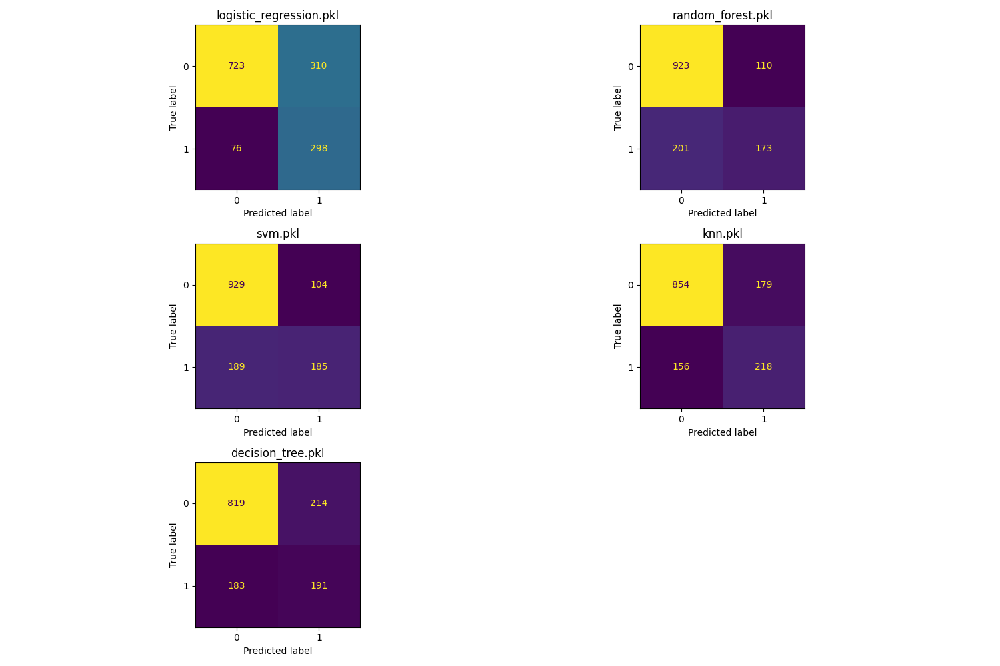
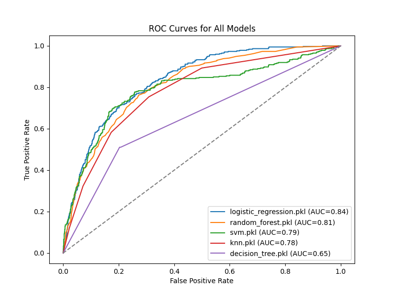
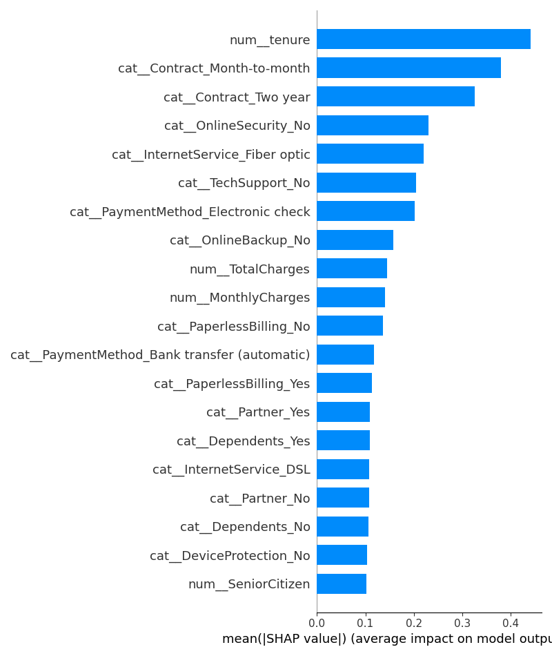
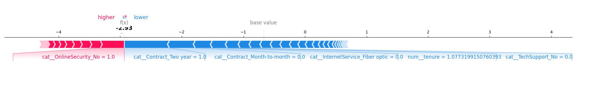
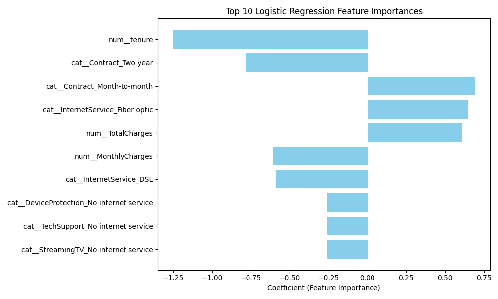
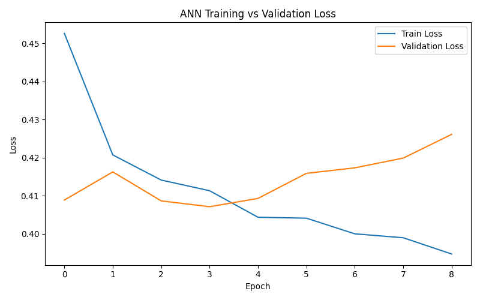

# Customer Churn Prediction — Machine Learning & Deep Learning

## Project Overview
This project presents a complete end-to-end Machine Learning pipeline for predicting customer churn using the Telco Customer Churn dataset.  
The objective is to obtain good predictive performance, demonstrate a rigorous, explainable, and reproducible data science workflow.

The project covers:
- Data preprocessing and feature engineering
- Training and comparison of multiple Machine Learning models
- Hyperparameter tuning
- Model explainability (SHAP and feature coefficients)
- A minimal Deep Learning model (Artificial Neural Network)
- Critical analysis, conclusions, and limitations

---

## Problem Statement
Customer churn prediction is a binary classification problem:

Can we predict whether a customer will leave the service (churn = 1) or stay (churn = 0) based on their demographics, contract details, and usage patterns?

From a business perspective, recall on the churn class is important, since failing to identify a customer who is about to churn can be costly.

---

## Dataset Description
- Dataset: Telco Customer Churn
- Source: [Public dataset (used for academic purposes)](https://raw.githubusercontent.com/alexeygrigorev/mlbookcamp-code/master/chapter-03-churn-prediction/WA_Fn-UseC_-Telco-Customer-Churn.csv)
- Target variable: `Churn` (Yes / No)
- Number of samples: ~7,000 customers
- Feature types:
  - Numerical: tenure, MonthlyCharges, TotalCharges, SeniorCitizen
  - Categorical: contract type, payment method, internet services, etc.

---

## Exploratory Data Analysis (EDA)
EDA was performed in the notebook `notebooks/eda.ipynb`.

Key observations:
- Customers with short tenure are significantly more likely to churn.
- Month-to-month contracts show higher churn rates.
- Long-term contracts (one-year, two-year) reduce churn probability.
- No extreme outliers requiring removal.

---

## Preprocessing & Feature Engineering
All preprocessing logic is in `scripts/preprocessing.py` and includes:
- Dropping non-informative identifiers
- Converting `TotalCharges` to numeric and handling missing values
- One-hot encoding of categorical variables
- Standard scaling of numerical features
- Stratified train-test split to preserve class balance

A Scikit-learn `Pipeline` and `ColumnTransformer` are used to prevent data leakage and ensure reproducibility.

---

## Machine Learning Models Evaluated
The following models were trained and evaluated using the same preprocessing pipeline:

- Logistic Regression (baseline and tuned)
- K-Nearest Neighbors (KNN)
- Decision Tree
- Random Forest
- Support Vector Machine (SVM)

Evaluation metrics:
- Precision, Recall, F1-score
- Confusion Matrices
- ROC Curves and AUC

Results and plots are saved in the `reports/` directory:
- `confusion_matrices.png` 
<p align="center">
  
</p>

- `roc_curves.png`
<p align="center">
  
</p>


---

## Hyperparameter Tuning
Hyperparameter tuning was performed for Logistic Regression using Grid Search:
- Regularization strength (C)
- Penalty type
- Solver choice

The tuned Logistic Regression model achieved the best balance between recall and interpretability and was selected as the main model.

Saved as:
- `models/logistic_regression_tuned.pkl`

---

## Model Explainability
Explainability analysis is in `scripts/explainability.py`.

### Global Explainability
- SHAP summary plot highlights the most influential features.
- Top drivers of churn:
  - Tenure (short tenure increases churn risk)
  - Month-to-month contracts
  - Long-term contracts reduce churn probability

Saved plot:
- `reports/shap_summary_plot.png`
<p align="center">
  
</p>

### Local Explainability
- SHAP force plot explains individual predictions for a single customer.
- Demonstrates how specific features push the prediction toward churn or retention.

Saved plot:
- `reports/shap_local_force_plot.png`
<p align="center">
  
</p>

### Coefficient-Based Feature Importance
- Logistic Regression coefficients are extracted and ranked.
- Top 10 features are visualized to provide an intuitive global interpretation.

Saved plot:
- `reports/logreg_feature_importance.png`
<p align="center">
  
</p>

---

## Deep Learning Model (ANN)
A minimal Artificial Neural Network was implemented in `scripts/ann.py`.

Architecture:
- Input layer (preprocessed features)
- Hidden layers: 64 → 32 neurons (ReLU)
- Output layer: 1 neuron (Sigmoid)

Training details:
- Optimizer: Adam
- Loss: Binary Cross-Entropy
- EarlyStopping used to prevent overfitting

Evaluation:
- ANN learns meaningful patterns but does not outperform the tuned Logistic Regression.
- Loss curves are analyzed to diagnose training behavior.

Saved plot:
- `reports/ann_loss_curve.png`
<p align="center">
  
</p>

---

## Project Structure
```
C:.
│   README.md
│   requirements.txt
│
├── models
│   ├── logistic_regression.pkl
│   ├── logistic_regression_tuned.pkl
│   ├── random_forest.pkl
│   ├── svm.pkl
│   ├── knn.pkl
│   └── decision_tree.pkl
│
├── notebooks
│   └── eda.ipynb
│
├── reports
│   ├── confusion_matrices.png
│   ├── roc_curves.png
│   ├── shap_summary_plot.png
│   ├── shap_local_force_plot.png
│   ├── logreg_feature_importance.png
│   └── ann_loss_curve.png
│
└── scripts
    ├── preprocessing.py
    ├── train.py
    ├── hyperparameter_tuning.py
    ├── evaluate.py
    ├── explainability.py
    └── ann.py

```

---

## Conclusions
- Logistic Regression, when properly tuned, provides strong performance and excellent interpretability.
- Tenure and contract type are the strongest predictors of churn.
- Deep Learning is not always superior for structured tabular data with limited samples.
- Explainability tools (SHAP) are used for understanding and trusting model predictions.


---


This project emphasizes clarity, reproducibility, and critical analysis over raw accuracy.
